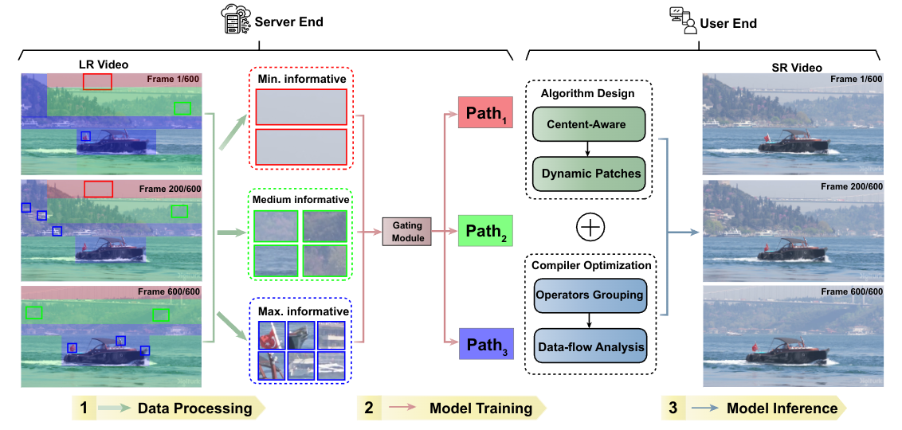

# Data Overfitting for On-Device Super-Resolution with Dynamic Algorithm and Compiler Co-Design
Sample code used for ECCV 2024 paper:
[Data Overfitting for On-Device Super-Resolution with Dynamic Algorithm and Compiler Co-Design](https://arxiv.org/abs/2407.02813)
## Introduction
we introduce a content-aware dynamic DNN to overfit videos. This design reduces the required model number down to one, thus reducing the model
switching overhead at the user end. In order to resolve the challenges brought By using dynamic input patches and routing in dynamic DNN, we propose a
data-flow analysis framework to predict the shape and value of intermediate tensor. Subsequently, the outcomes of the analysis are used to enable a number
of compilation optimizations, which achieve real-time performance on the edge.




Overview of the proposed Dy-DCA method. 

## Requirement
* Python >= 3.6
* Torch >= 1.0.0
* torchvision
* numpy
## Dataset
The dataset(UVG) can be founded in [UVG](https://ultravideo.fi/dataset.html)
The dataset(VSD4K) can be founded in [CaFM-Pytorch-ICCV2021](https://github.com/Neural-video-delivery/CaFM-Pytorch-ICCV2021)  

Please download and organize data like: 
```
path/to/data/video topic_length/
├── DIV2K_train_HR
└── DIV2K_train_LR_bicubic
    └── X2
        └─ 00001_x2.png
    └── X3
        └─ 00001_x3.png
    └── X4
        └─ 00001_x4.png
e.g.
home/lee/data/vlog_15/
├── DIV2K_train_HR
└──DIV2K_train_LR_bicubic
    └── X2
    └── X3
    └── X4
```
## Content-Aware data processing pipeline
* Please see the `script/vlog_15/vlog_15_preprocessing`. This helps generate patches according to content information.  

## Train
We will use `trainer.py` and `VSD4K.py` for our experiments. The key arguments and their usage are listed below.  
For `trainer.py`:  
- `--source_path` This argument specifies the path to your dataset. Default setting is:`/home/lee/data/`
- `--chunk` This argument specifies which chunk you will train.
- `--k` This argument specifies the number of chunks we want to divide into.
- `--tt` This argument specifies video topic and video length. (e.g. vlog_15, inter_45)
- `--scale` This argument specifies the scale factor for image super-resolution.. We demonstrate 2,3 and 4 results.
- `--save_img` This argument determines whether the generated images are stored.  
- `--save_label` This argument determines whether to store the PSNR value for each patches.  
- `--eval_only` This argument used for evaluation only.

For `dyna_psnr.py`:
- `--type` This argument is the same as `--scale`
- `--time` This argument specifies the video length.
- `--size_w` This argument specifies how many patches we want to split on width.
- `--size_h` This argument specifies how many patches we want to split on height.
- `--psnr_threshold` This argument specifies the threshold for patches.
- `--source_path` This argument specifies the place to the datasets
Detailed training script can be found in `./script/vlog_15/vlog_15_train`


# Citation

This code is partially based on our previous work
[Towards High-Quality and Efficient Video Super-Resolution via Spatial-Temporal Data Overfitting](https://arxiv.org/abs/2303.08331)

if you find this repo is helpful, please cite
```
@article{li2024data,
  title={Data Overfitting for On-Device Super-Resolution with Dynamic Algorithm and Compiler Co-Design},
  author={Li, Gen and Shu, Zhihao and Ji, Jie and Qin, Minghai and Afghah, Fatemeh and Niu, Wei and Ma, Xiaolong},
  journal={arXiv preprint arXiv:2407.02813},
  year={2024}
}

@InProceedings{Li_2023_CVPR,
    author    = {Li, Gen and Ji, Jie and Qin, Minghai and Niu, Wei and Ren, Bin and Afghah, Fatemeh and Guo, Linke and Ma, Xiaolong},
    title     = {Towards High-Quality and Efficient Video Super-Resolution via Spatial-Temporal Data Overfitting},
    booktitle = {Proceedings of the IEEE/CVF Conference on Computer Vision and Pattern Recognition (CVPR)},
    month     = {June},
    year      = {2023},
    pages     = {10259-10269}
}

```
